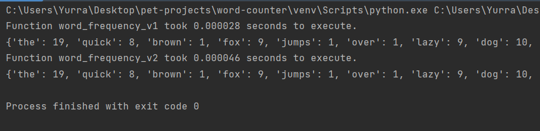

# word-counter

**comparison of two algorithms for counting words in a text file**



Time complexity of the two algorithms:
1. word_frequency_v1: O(n)
2. word_frequency_v2: O(n * m)
_where n is the number of words in the text file and m is the number of unique words in the text file._

## Installation

```bash
git clone https://github.com/yura-hudzovskyi/word-counter.git
```

```bash
python -m venv venv
source venv/bin/activate
pip install -r requirements.txt
```

usage:
```bash
python main.py
```
